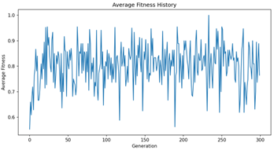
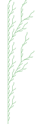

# Computational_Intelligence-Project

This repository contains the final project for the course ```Computatinal Intelligence```. The project aims to optimzie Lindenmayer Systems or L-Systems using Computational Intelligence techniques, mainly Evolutionary Algorithms.

For the project, we mainly referred to the paper [Reference Paper](On_Genetic_Algorithms_and_Lindenmayer_Sy%20(1).pdf) and mainly followed the theory and approach described here. 

Our final report and paper can also be found [here](Lindenmayer_Optimization_An_Evolutionary_Algorithm_Framework.pdf)

### Background 
L-systems, or Lindenmayer systems, are a mathematical formalism introduced by biologist Aristid Lidenmayer in 1968. They describe growth processes of biological organisms and find applications in computer graphics, particularly for generating complex and natural-looking structures.


### Problem Addressed
We aim to optimize L-systems to fulfill specific criteria such as realism, complexity, or symmetry. While L-systems can self-generate, they often lack optimization for desired properties. By employing EAs, we can evolve L-system rules to produce structures that better fulfill these properties.

Said properties mainly include the following:
1. **Vertical Tropism:** assesses the upward growth of plants. Taller plants are more adept at accessing sunlight for photosynthesis and spreading seeds, thus promoting their growth and propagation 
2. **Bilateral Symmetry:** assesses the balance and proportionality of plant structures. Plants with better symmetry exhibit a well-balanced branching pattern on both sides of the trunk, enhancing stability and aesthetic appeal
3. **Stability:** measures the structural integrity of plants. Plants with fewer branches emanating from each point are considered more stable, as excessive branching can lead to structural weakness.
4. **Photon Harvesting Ability:** quantifies the plant's efficiency in capturing sunlight for photosynthesis.
5. **Branching Proliferation:** examines the density and abundance of branches in plant structures. Plants with a higher proportion of branching points and multiple branches demonstrate enhanced capacity for resource acquisition and reproduction.

### Evolutionary Algorithm Applied

- **Population and Chromosome Representation**: For our problem, a chromosome consists of rules of the L-System. Thus, the population comprises an array of L-system rules, where each string corresponds to a chromosome. These chromosomes translate into paths represented as Cartesian Coordinates $(x, y, \theta)$

- **Fitness Function:** For each of the above properties, we define a fitness function that quantifies how well the L-system fulfills the property. For each property, a different fitness function is implemented that is suited to the property's characteristics. Then the overall fitness is calculated as the weighted sum of the individual fitnesses. Some combination of properties do exhibit contradicting behavior, thus the resulting structures may not be optimal for all properties, rather a trade-off is achieved.

- **Crossover:** A simple crossover is implemented where two parent chromosomes are selected and then crossover points are randomly selected to exchange genetic material.

- **Mutation:** Block mutation has been used wherein a block or segment of the chromosome is randomly selected and replaced with a mutated segment. This allows for a more diverse population and exploration of the search space.

- **Selection Schemes:** For both the parent and child selection schemes, we have experimented with the following selection methods:
    - **Truncation Selection**
    - **Fitness Proportion Selection**
    - **Tournament Selection**
    - **Rank Based Selection**
    with the addition of **Random Selection** in parent selection. 

### Experiments and Results

Some of the results we achieved the following results for the different experiments:

<div>
<b>Vertical Tropism</b>
<br>
 
</div>